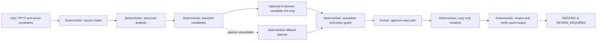
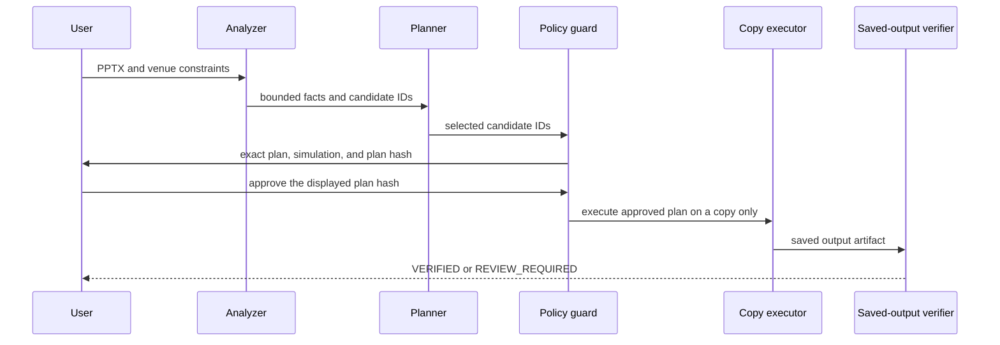

# Venue Agent

**A venue-aware presentation repair agent that improves supported slide text for a defined viewing setup—then verifies the saved copy before reporting the outcome.**

**[Try the live demo →](https://venue-agent-production.up.railway.app)** &nbsp;|&nbsp; WCC Launchpad 30 — Track 01: Agentic AI

## The problem

PowerPoint understands the slide. AV tools understand the room. The audience experiences both.

Text that seems acceptable on a presenter's laptop can create greater structural visual demand when it is projected into a bounded active image and viewed from a real distance. Venue Agent connects those inputs: it inspects a PPTX's supported structural text, evaluates it against a named reference profile and venue geometry, and offers bounded repairs under explicit user constraints.

It does **not** claim that every person can read every slide. It makes a narrower, inspectable claim about the supported structural-text scope it can analyze and verify.

## What Venue Agent does

Venue Agent runs a closed loop rather than stopping at advice:

1. Upload a PPTX or load the project-owned demo.
2. Describe the venue and viewing setup.
3. Analyze supported structural text against the reference profile.
4. Generate only server-approved repair candidates.
5. Select a safe combination under the user's constraints.
6. Simulate the combined change and show the exact plan.
7. Require explicit approval.
8. Apply the approved repair to a **copy**, never the original.
9. Reopen and re-analyze the saved output before returning `VERIFIED` or `REVIEW_REQUIRED`.

The result is a reviewable artifact, not an opaque “fixed your deck” promise.

## Try it

**Live:** [https://venue-agent-production.up.railway.app](https://venue-agent-production.up.railway.app)

No Gemini key is required for the core demo. If an optional Gemini planner is unavailable, the deterministic planner fallback keeps the bounded workflow available.

### 60-second judge path

1. Open the live demo and load the sample deck.
2. Enter the venue settings and run analysis.
3. Inspect the proposed bounded repair and its projected result.
4. Approve the exact plan.
5. Watch the service create a copy, reopen it, and verify the saved artifact.

The planner recommends. The verifier decides.

## Why Agentic AI?

The agent is used where judgment is useful: selecting among several already-simulated, server-generated repair candidates while honoring repair constraints. It is not given arbitrary PowerPoint commands, arbitrary font sizes, or authority to certify its own output.

```text
deterministic facts
→ bounded candidate generation
→ agentic trade-off selection
→ deterministic policy and simulation
→ human approval
→ deterministic mutation
→ fresh saved-artifact verification
```

When configured, the optional Gemini planner receives bounded planning context and permitted candidate IDs. Its decision is canonicalized and checked against server-side candidates and constraints. If it fails, times out, or is not configured, a deterministic fallback planner makes a bounded choice instead. Safety never depends on model intelligence.

Deterministic components own geometry, reference lookup, candidate legality, simulation, approval integrity, mutation, and final verification. **The agent can recommend a repair. It cannot certify its own work.**

## Architecture



The labels identify the authority boundary: the AI planner selects from a bounded set; deterministic services and the user retain control over every consequential operation.

## Trust loop



Approval is not a vague “yes.” The approval hash binds the source digest, selected candidate snapshots, constraints, and plan simulation. Replanning clears stale approval and output state; execution also checks source identity and idempotency.

## Trust model

- **The original stays untouched.** Approved mutations write `output.pptx` in an ephemeral session; the source SHA-256 is checked during verification.
- **Approval is exact.** A changed source, plan, candidate snapshot, constraint set, or simulation invalidates what can be approved.
- **Unknown does not become safe.** Unsupported, outside-reference, boundary, or otherwise uncovered visible content prevents a whole-deck `VERIFIED` result.
- **AI has bounded authority.** The planner can select only legal, server-generated candidates; policy and simulation validate the selection again.
- **The saved output is checked.** Verification reopens the saved PPTX, renders and re-analyzes it, audits structural transitions, and checks required postconditions from the artifact—not planner predictions.
- **Output identity is bound.** The downloadable bytes are SHA-256-bound to the verified output artifact.
- **Presentation text is data.** Slide content is treated as untrusted input, not as privileged instructions to the planner.

## What `VERIFIED` means

`VERIFIED` is a narrow product state, not a certification. It means the saved output passed Venue Agent's defined postconditions for the supported analysis scope: the source remained unchanged; the output reopened; visible text was preserved; targeted structural values improved; the analyzed universe and layout remained safe; and no unknown or uncovered condition remained that blocks verification.

It is **not** a human-readability guarantee, accessibility or WCAG conformance finding, AVIXA certification, or proof that LibreOffice rendering is identical to Microsoft PowerPoint.

## When the agent refuses

Refusal and review are intended product outcomes. Venue Agent can return a terminal non-success state when there is no justified automatic action:

- unsupported or uncovered visible content leads to `REVIEW_REQUIRED` rather than a whole-deck `VERIFIED`;
- title and heading candidates are never automatically mutated;
- uncertain font inheritance, AutoFit, mapping, or analysis boundaries remain review-only;
- constraints that leave no safe combined repair produce `NO_FEASIBLE_PLAN`;
- a deck with adequate, fully covered supported text can return `NO_ACTION_REQUIRED`;
- a rejected or stale plan produces no mutation.

## How this differs from presentation AI

These are workflow categories, not claims about any particular vendor or product.

| Tool category | Primary focus | Physical venue in the repair loop | Bounded repair and approval | Saved-artifact verification |
|---|---|---:|---:|---:|
| Generic presentation AI | Content or visual authoring | Not its defining workflow | Varies | Varies |
| Font-size checker | Slide-level typography | Usually absent | Usually advisory | Usually absent |
| Display or room calculator | Display and viewing geometry | Yes | No deck mutation loop | No PPTX verification loop |
| **Venue Agent** | Existing PPTX × venue × constraints | Yes | Yes | Yes, for its supported scope |

The difference is the complete loop: **actual presentation structure × physical venue × bounded repair × explicit approval × saved-output verification**.

## Supported scope

Venue Agent deliberately limits what it will mutate. This is a safety boundary, not a claim that the rest of a deck is unimportant.

| Content | Analysis | Automatic repair | Final behavior |
|---|---|---|---|
| Ordinary horizontal body text with explicit font family and size | Structural-text analysis | Bounded font scaling | Eligible for verification when all postconditions hold |
| Titles and headings | May be identified and analyzed | Never automatic | Protected; review or no feasible automated plan |
| Inherited fonts, AutoFit, rotated text, or ambiguous mappings | Limited or review-only | No | Review required |
| Tables and grouped content | Unsupported coverage | No | Review required |
| Charts, pictures, SmartArt, diagrams, media, embedded or OLE content | Unsupported visible-content coverage; unsafe packages may be rejected at intake | No | Review required or upload rejected |
| Master/layout text outside the supported mapping | Unsupported coverage | No | Review required |

The system does not perform semantic rewriting in this version. It does not analyze OCR/image text, charts, arbitrary rotations, right-to-left or non-Latin shaping, lighting, glare, contrast, or individual visual acuity.

## Responsible intake and runtime design

PPTX files are untrusted input. The service applies bounded upload and request sizes, OOXML package and relationship validation, decompression/resource limits, and rejects unsafe package features such as embedded OLE/ActiveX content and external linked resources. It uses capability-protected, process-local ephemeral sessions, restrictive artifact permissions where supported, cache-control protections, cleanup, and serialized session operations.

LibreOffice rendering runs with dedicated temporary profiles, timeouts, concurrency limits, and stale-render protection. The container runs the service as a non-root user. Venue Agent does not claim general process or network sandboxing for LibreOffice; that remains a deployment risk to assess for a broader production environment.

## Technical architecture

**Backend and analysis:** FastAPI and Pydantic coordinate the workflow; `python-pptx` parses and mutates supported text; LibreOffice headless produces rendering evidence; PyMuPDF reads the generated PDF; and a named public BDM-derived reference profile supplies the comparison basis.

**Planning:** deterministic analysis and candidate generation precede an optional, bounded Gemini planner. The fallback planner is deterministic. Neither planner issues raw mutation commands.

**Integrity:** plan hashes, source SHA-256 checks, candidate snapshots, simulation fingerprints, idempotency keys, copy-only execution, fresh saved-artifact verification, and verified-output SHA binding form the main trust controls.

## Validation evidence

Validation is intentionally reported as evidence rather than as an all-purpose quality claim. See [the release status](validation/RELEASE_STATUS.md) for the detailed record and limitations.

| Validation area | Recorded result |
|---|---|
| Production health and readiness | Verified against the deployed service |
| Missing or wrong `/plan` capability | Rejected without session-state mutation |
| Supported demo repair workflow | Verified through copy, reopen, and saved-artifact verification |
| Unsupported picture coverage | Review-required; it cannot become whole-deck `VERIFIED` |
| Title protection and source immutability | Verified in targeted regression coverage |
| Downloaded artifact identity | Download SHA matched the verified-output SHA |
| Full local Windows suite | Environment-limited; no blanket all-tests-passed claim |

## Prior research disclosure

Earlier domain research explored room-aware structural presentation analysis. Venue Agent is a new agentic repair-and-verification implementation: its source, UI, API, tests, and fixtures were not reused from that prior work. See [the AI tool disclosure](docs/AI_TOOL_DISCLOSURE.md) and [judging map](docs/JUDGING_MAP.md) for the project evidence trail.

## Limitations

- It does not guarantee readability for every viewer or every slide.
- It is not an accessibility, WCAG, PowerPoint, or AVIXA certification tool.
- Complex visual objects are not automatically repaired.
- LibreOffice evidence is not proof of Microsoft PowerPoint rendering equivalence.
- Session state is process-local, so the deployed contract requires exactly one Uvicorn worker and one Railway replica.
- This is a bounded V1 workflow, not a general-purpose presentation editor.

## Run locally

Requirements: Python 3.12, LibreOffice/Impress available on `PATH`, and the dependencies declared by the backend project.

```powershell
cd backend
python -m pip install -e ".[agent]"
python -m uvicorn app.main:app --host 127.0.0.1 --port 8000 --workers 1
```

Open `http://127.0.0.1:8000`. The frontend is served by the FastAPI application. `GEMINI_API_KEY` is optional; without it, the deterministic planner fallback is used.

Useful repository checks from the repository root include:

```powershell
cd backend
python -m pytest -q
cd ..
python scripts/check_frontend_js.py
python scripts/release_gate.py
```

## Deployment contract

The deployed application is one FastAPI/Uvicorn service with frontend static files served by the backend and LibreOffice available for rendering. The Docker configuration runs one Uvicorn worker; Railway readiness checks use `/health/readiness`. Keep the service at **one replica** because session state is intentionally process-local.

## Repository evidence

- [Product contract](docs/PRODUCT_CONTRACT.md)
- [Claims and limitations](docs/CLAIMS_AND_LIMITATIONS.md)
- [Demo script](docs/DEMO_SCRIPT.md)
- [Judging map](docs/JUDGING_MAP.md)
- [AI tool disclosure](docs/AI_TOOL_DISCLOSURE.md)
- [Release status](validation/RELEASE_STATUS.md)
